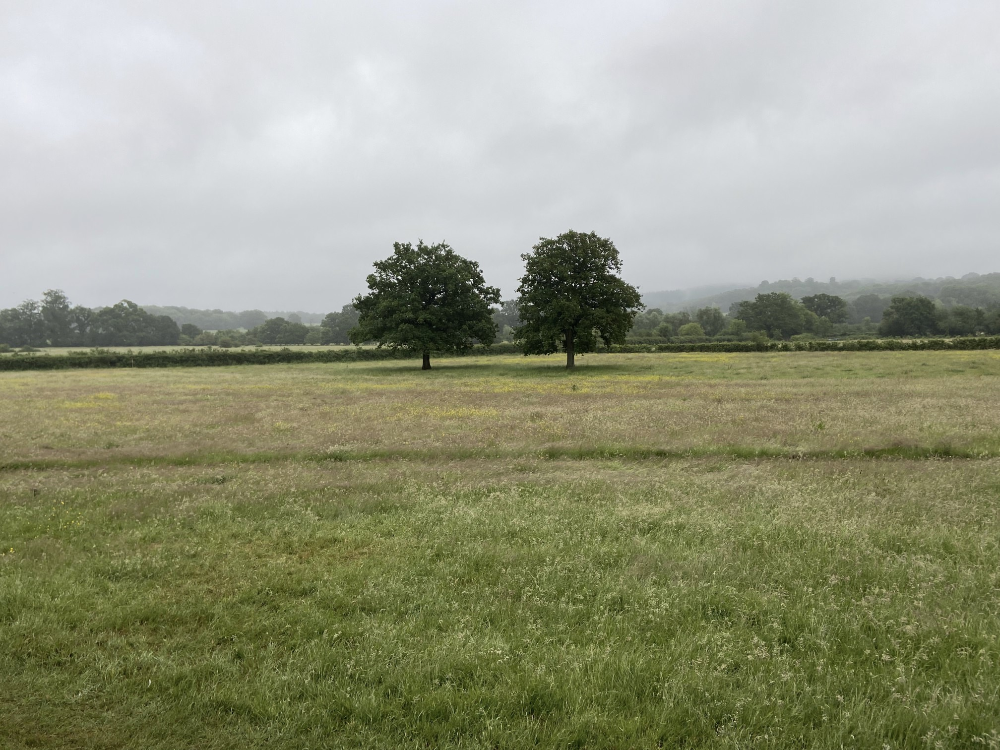

# BlurHash plugin for Craft CMS 3.x

[](https://plant.treeware.earth/dodecastudio/craft-blurhash)


**Render a BlurHash from a given asset in Craft CMS.**

A [BlurHash](https://blurha.sh/) is a compact representation of a placeholder for an image. A blurred version of an image, useful for displaying whilst the full resolution image is loading.

## Requirements

* Craft CMD 3.x
* GD / ImageMagick (*as required by Craft CMS*)

## Installation

Install the plugin as follows:

1. Open your terminal and go to your Craft project:

        cd /path/to/project

2. Then tell Composer to load the plugin:

        composer require github.com/dodecastudio/craft-blurhash

3. In the Control Panel, go to Settings → Plugins and click the “Install” button for BlurHash.

## BlurHash Overview

The BlurHash plugin will generate a BlurHash image from a craft asset. Here's an example of what you can expect:

### Input:


### Result:


## Using BlurHash

### Common use

To use the plugin, first grab an asset from Craft, perhaps something like this:

```twig

```

You can then pass your asset to the plugin's `blurhash` function, which will return a blurhash image as a data-url, perfect for using in an `img` element like so:

```twig

```

### Other features

#### Generating a blurhash string

If you just want to generate just a blurhash string from a given asset, you can use the `blurhash` filter like this:

```twig
{{ testAsset|blurhash }}
```

Which will return something like this:

```
twigK-I#.3ofof_4ofj[%Mayay
```

You might want to store this in some way, for use later.

#### Generating a blurhash image from a blurhash string

If you already have a blurhash string and want to generate an image from it, you can use the `blurhashToUri` function like this:

```twig

```

## Licence 🌳           

This package is [Treeware](https://treeware.earth). If you use it in production, then we ask that you [**buy the world a tree**](https://plant.treeware.earth/ostark/craft-async-queue). And why wouldn't you? By contributing to the Treeware forest you’ll be creating employment for local families and restoring wildlife habitats. 